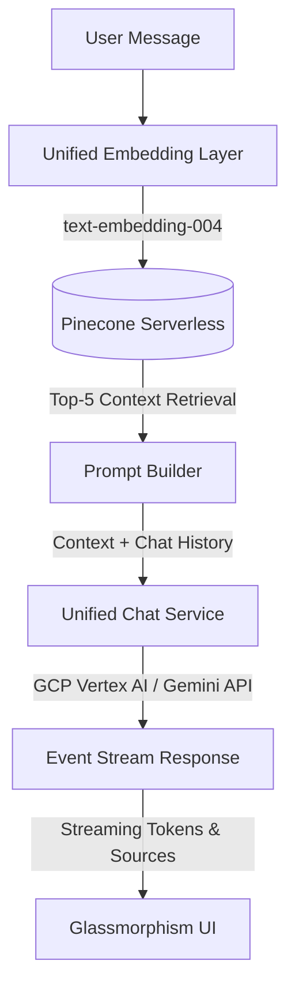

# 🚀 Interactive AI Portfolio & RAG Chatbot Assistant

An elegant, state-of-the-art developer portfolio integrated with a production-ready **Retrieval-Augmented Generation (RAG)** chatbot. The assistant is designed to act as a highly specialized agent that semantically searches Kunal's background, education, projects, and work history to answer technical and recruiter Q&A queries with high precision and formatted source citations.

---

## 🌟 Key Features

* **🤖 Smart RAG Assistant:** Answers questions about projects, experience, skills, and background using real-time context retrieval.
* **⚡ Multi-Backend Unified Embeddings:** Auto-detects and switches between three embedding backends depending on active credentials:
  1. **Vertex AI** (`text-embedding-004`) — 768-dim (Recommended / Production)
  2. **Google AI Studio** (`gemini-embedding-001`) — 768-dim (Fallback)
  3. **Hugging Face** (`sentence-transformers/all-MiniLM-L6-v2`) — 384-dim (Free/Local)
* **🌲 Vector Search Index:** Powered by **Pinecone Serverless** (`portfolio-rag`) for ultra-low latency semantic querying and metadata-filtered results.
* **🪐 Dual Model Chat Stream:** Auto-detects and leverages **Google Cloud Vertex AI** (`gemini-2.5-flash`) or falls back directly to **Google AI Studio** (`gemini-2.0-flash-lite`) via streaming server-sent events (SSE).
* **📖 Dynamic Source Citations:** Automatically detects and displays human-readable, styled source labels (e.g., `📖 Master Profile`, `📄 Professional Resume`, `💼 Work History`, `🚀 Featured Projects`) at the bottom of assistant bubbles.
* **🛡️ Production Ready Controls:** Built-in IP-based rate limiting (10 requests/minute) to protect API quotas and credits from scraping or credit exhaustion.
* **🎨 Stunning Glassmorphism UI:** Tailored dark mode, smooth gradient backdrops, sleek loading animations, and dynamic transitions.

---

## 📐 Architecture & Flow



---

## 🛠️ Tech Stack

* **Frontend Framework:** Next.js (App Router, Client/Server Components)
* **Styles:** Vanilla CSS with premium glassmorphism, tailored color palettes, and micro-animations
* **Vector Store:** Pinecone Serverless (AWS / `us-east-1`)
* **AI & LLM Services:** Google Cloud Vertex AI (Gemini 2.5 Flash), Google AI Studio (Gemini 2.0 Flash Lite)
* **Embedding Models:** Vertex AI `text-embedding-004`, Gemini `gemini-embedding-001`
* **Infrastructure:** Vercel (Production Hosting), Git/GitHub (CI/CD integration)

---

## 📁 Key File Structure

```text
├── app/
│   ├── api/
│   │   └── chat/                 # Stream RAG endpoint with rate-limiting & auth
│   ├── components/
│   │   └── chat/                 # Interactive Chat bubbles & typing dots
│   │       ├── ChatMessage.tsx   # Source citations & markdown renderer
│   │       └── ChatPanel.tsx     # Session persistence & input controls
│   └── page.tsx                  # Portfolio dashboard
├── data/
│   ├── experience.txt            # Work history corpus
│   ├── resume.txt                # Resume corpus
│   ├── skills.txt                # Skills corpus
│   └── projects/                 # Highlighted projects details
├── lib/
│   ├── google/
│   │   └── auth.ts               # Google Cloud Service Account Bearer Token Cache
│   ├── pinecone/
│   │   └── client.ts             # Index query/upsert manager
│   ├── prompts/
│   │   └── system.ts             # Context formatting & Guardrails prompt
│   └── rag/
│       └── embeddings.ts         # Multi-backend unified embedding layer
├── scripts/
│   └── ingest.ts                 # Automated document ingestion & indexing pipeline
├── portfolio_rag_knowledge_base_master_profile.md  # Comprehensive Recruiter Q&A Profile
└── .env.local                    # Secret keys & environment configurations
```

---

## ⚙️ Environment Configuration

To run the application locally or deploy to production, create a `.env.local` file in your root folder:

```ini
# --- Pinecone Configuration ---
PINECONE_API_KEY=your_pinecone_api_key
PINECONE_INDEX_NAME=portfolio-rag

# --- Production: Google Cloud Vertex AI ---
GOOGLE_CLOUD_PROJECT=your-gcp-project-id
GOOGLE_CLOUD_LOCATION=us-central1
GOOGLE_SERVICE_ACCOUNT_JSON=google-key.json # Stored in root (ignored in git)

# --- Fallback: Google AI Studio ---
GEMINI_API_KEY=your_gemini_api_key

# --- Local Embeddings (Optional) ---
HUGGING_FACE_API_KEY=your_hugging_face_token
```

---

## 🚀 Getting Started

### 1. Install Dependencies
```bash
npm install
```

### 2. Ingest & Index Data into Pinecone
The ingestion pipeline automatically collects, chunks, embeds, and indexes all text/markdown corpora inside the `/data` folder and the root `portfolio_rag_knowledge_base_master_profile.md` file:
```bash
npm run ingest
```
*Note: The script automatically detects active credentials and ensures the Pinecone index is created with correct dimensions (e.g., 768 dimensions for Google models).*

### 3. Run Development Server
```bash
npm run dev
```
Open [http://localhost:3000](http://localhost:3000) (or the port specified in terminal) in your browser.

### 4. Build Production Bundle
To compile and test static rendering and TypeScript type validity locally before pushing to Vercel:
```bash
npm run build
```

---

## 🛡️ Recruiter Guardrails & Safety
The system prompt is heavily engineered ([system.ts](file:///c:/Users/Kunal/OneDrive/Documents/portfolio-kunal/lib/prompts/system.ts)) to enforce these behaviors:
1. **Source Grounding:** Only answers questions supported by the ingested files.
2. **Graceful Fallback:** If the question cannot be answered from the retrieved context, it returns: 
   *"I don't have enough information about that yet. You can reach Kunal directly at kunal.pandey.work@outlook.com or visit his GitHub at https://github.com/kpkp95."*
3. **No Hallucinations:** Never invents or assumes skills, tools, or projects.

---

## 🚢 Vercel Deployment

1. **Import Project:** Import your GitHub repository to Vercel.
2. **Environment Variables:** Copy your `.env.local` variables directly into Vercel's Environment Variables settings.
3. **Vertex AI credentials:** For Vercel production hosting, paste the **raw JSON string** of your Google service account file directly into the `GOOGLE_SERVICE_ACCOUNT_JSON` environment variable. The auth helper dynamically parses it!
4. **Deploy:** Vercel automatically builds and deploys the optimized Next.js app.
